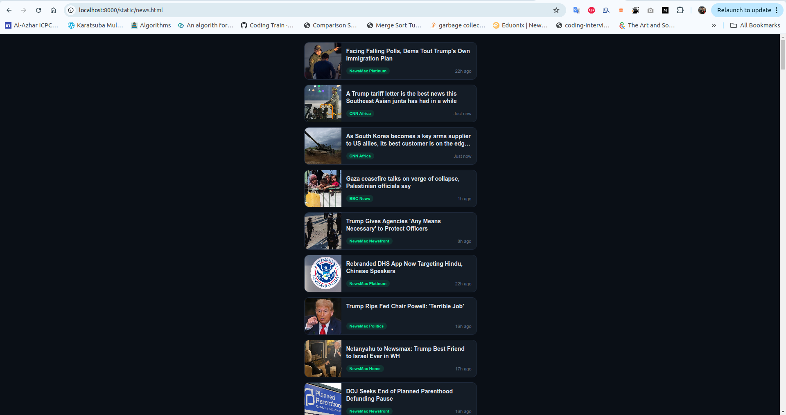
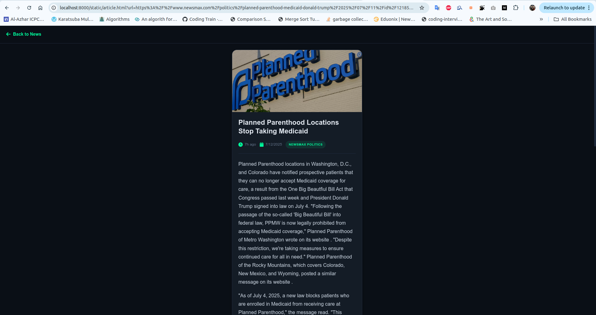

# News Scraper Service

A Dockerized news aggregation system that scrapes articles from multiple news sources (BBC, CNN, and Newsmax), stores them in a PostgreSQL database, and provides a modern web interface for viewing articles.

## Overview

This service consists of three main components:
1. **Three independent Python microservices** for scraping news from different sources
2. **PostgreSQL database** for storing articles with deduplication
3. **FastAPI web server** with HTML interface for viewing articles

## Architecture
The system uses the following services:

1. **BBC RSS Scraper** (`scrapers/bbc_scraper.py`)
   - Fetches articles from multiple BBC RSS feeds in the last 24 hours
   - Covers categories: World, Technology, Health, Education, Science & Environment

2. **CNN Homepage Scraper** (`scrapers/cnn_scraper.py`)
   - Scrapes CNN.com homepage directly (no RSS)
   - Uses BeautifulSoup for HTML parsing

3. **Newsmax Homepage Scraper** (`scrapers/newsmax_scraper.py`)
   - Scrapes Newsmax.com homepage using Selenium WebDriver (chrome for testing)
   - Uses headless Chrome browser for JavaScript rendering
   - Handles dynamic content loading

### Database Schema
PostgreSQL database with the following table structure:
```sql
CREATE TABLE articles (
    title_of_article TEXT UNIQUE,
    url_of_article TEXT UNIQUE,
    full_content_of_article TEXT,
    main_picture_of_article_url TEXT,
    published_utc TIMESTAMP WITH TIME ZONE,
    fetch_datetime_utc TIMESTAMP WITH TIME ZONE,
    main_category TEXT
);
```

### Deduplication Strategy
- **Primary deduplication**: Uses database UNIQUE constraints on both `title_of_article` and `url_of_article`
- **Secondary check**: Before insertion, queries existing articles by URL and title
- **Performance optimization**: Database indexes on URL and title fields for fast lookups

## Features

### Core Functionality
- **Continuous Operation**: All scrapers run every 60 seconds automatically
- **Initial Bulk Fetch**: Fetches all available articles on first launch
- **Smart Deduplication**: Prevents duplicate articles using efficient database queries
- **Metadata Capture**: Stores title, URL, content, main image, publication time, fetch time, and category


## How to Use

### Prerequisites
- Docker and Docker Compose installed
- Internet connection for scraping news websites

### Quick Start
1. **Clone and navigate to the project directory**
   ```bash
   cd news-scraper
   ```

2. **Start all services**
   ```bash
   docker-compose up -d
   ```

3. **Access the web interface**
   - Open your browser and go to: `http://localhost:8000/static/news.html`
   - The interface will automatically start displaying articles as they are scraped

4. **Monitor the services**
   ```bash
   # View logs for all services
   docker-compose logs -f
   
   # View logs for specific scraper
   docker-compose logs -f bbc
   docker-compose logs -f cnn
   docker-compose logs -f newsmax
   ```

### Service Endpoints
- **Web Interface**: `http://localhost:8000/static/news.html`
- **API Articles List**: `http://localhost:8000/articles`
- **API Single Article**: `http://localhost:8000/article?url=<article_url>`
- **PostgreSQL**: `localhost:5432` (credentials: postgres/password)

## Technical Implementation

### Base Scraper Class
All scrapers inherit from `BaseScraper` class which provides:
- Database connection management
- Article saving with deduplication logic
- Continuous execution with error handling


### Anti-Scraping Countermeasures (Newsmax)
- **Headless Browser**: Uses Selenium with Chrome WebDriver
- **User Agent Rotation**: Custom user agent strings
- **Request Delays**: Built-in delays between requests
- **Browser Options**: Disabled automation detection features

## File Structure
```
news-scraper/
├── docker-compose.yml          # Container orchestration
├── Dockerfile                  # Container build instructions
├── requirements.txt            # Python dependencies
├── init_db.sql                 # Database schema
├── api/
│   └── api.py                  # FastAPI web server
├── scrapers/
│   ├── __init__.py
│   ├── base_scraper.py        # Base class for all scrapers
│   ├── bbc_scraper.py         # BBC RSS scraper
│   ├── cnn_scraper.py         # CNN homepage scraper
│   └── newsmax_scraper.py     # Newsmax scraper with Selenium
└── static/
    ├── news.html              # Main news listing page
    └── article.html           # Individual article view page
```

## Screenshots

